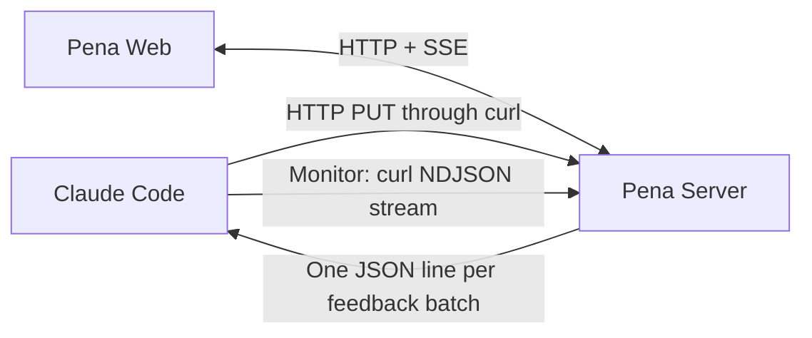

# PRD

Pena — [Initial Specification](./INITIAL_SPEC.md)

# Overview

[!info]
*This is the initial architecture. The implementation may introduce different or better decisions later.*

Pena is a local web-based document review interface. Claude publishes a Markdown document to Pena, the user reviews it in the browser, and Pena sends the submitted feedback back to the active Claude Code session.

The important part is the last step. Pena should send the feedback without interrupting Claude's ongoing work and without requiring the user to return to the terminal.

# System Design



Pena consists of three initial components:

- **Pena Server** — stores the current document and pending feedback, exposes the HTTP API, and publishes events.
- **Pena Web** — renders the document and collects comments attached to selected text.
- **Pena Skill** — tells Claude how to publish a document, start the feedback monitor, and react to incoming feedback.

## The Pena Server

The Pena Server is a local HTTP server bound to `127.0.0.1`. It is the shared boundary between Claude Code and the browser.

Its initial responsibilities are:

- Accept a Markdown document from Claude.
- Return the current document to the browser.
- Accept a batch of comments from the browser.
- Keep submitted feedback available until it can be delivered.
- Stream document and feedback events.

Pena does not associate a Claude Code session identity with a document. The initial scope only supports one active Claude Code session, so a single feedback consumer is enough.

## The Pena Web

The web interface reads the current Markdown document from the Pena Server. The user can select text, attach a comment, repeat the same process for other passages, and submit the comments together.

The browser uses normal HTTP for reading and submitting data. SSE may be used to refresh the displayed document when Claude replaces its content.

The interface uses dark mode from the beginning. This includes the document surface, comment panel, text selection, comment markers, and Markdown code blocks. The initial version can use plain CSS with shared color variables; a styling framework is not needed yet.

There is no document list, search, or navigation interface for now. The document can be opened through its direct local URL.

## The Pena Skill

The Pena Skill describes the workflow Claude should follow when working with Pena:

1. Publish the requested document through the Pena HTTP API using `curl`.
2. Start one background Monitor for the feedback stream if it is not already running.
3. Continue the current work normally.
4. When feedback arrives, preserve the current operation and apply the feedback at a natural opportunity.
5. Publish the updated document when another review cycle is needed.

For example, Claude can publish a document with:

```bash
curl --request PUT \
  --header "Content-Type: text/markdown" \
  --data-binary @document.md \
  http://127.0.0.1:8788/api/document
```

The skill contains the HTTP endpoints and the exact commands, so a dedicated Pena CLI is not needed for the initial version.

## The Feedback Delivery

Claude Code's Monitor tool can run a command for the lifetime of the session and deliver each output line to Claude as a notification. This makes a persistent HTTP stream possible without wrapping or replacing the normal Claude Code terminal session.

The Claude-facing stream uses newline-delimited JSON rather than raw SSE. Each feedback batch is written as one complete JSON line, which maps naturally to one Monitor notification.

For example:

```json
{"type":"feedback.submitted","document":"current","comments":[{"selected_text":"The selected passage","comment":"The feedback"}]}
```

The flow is:

1. Claude starts a Monitor running `curl --silent --no-buffer http://127.0.0.1:8788/api/feedback/stream`.
2. `curl` keeps the HTTP connection open.
3. The user submits one or more comments.
4. The Pena Server creates one feedback event.
5. The Pena Server writes the event as one JSON line.
6. Claude Code receives the line as a Monitor notification.
7. Claude decides when and how to apply the feedback.

Monitor notifications may arrive while Claude is working. They do not stop the running command, but Claude may react to them during the current conversation. The Pena Skill must explicitly instruct Claude not to abandon the ongoing operation only because feedback has arrived.

This behavior should be validated with an integration spike before building the complete review interface.

# The Integration Options

## Option #1: Claude Code Channel

A custom Claude Code Channel can push events from an MCP server directly into the active session.

Pros:

- Designed specifically for pushing external events into a running Claude Code session.
- Events are queued while Claude is busy.
- Does not require Pena to manage Claude Code itself.

Cons:

- Channels are still in research preview.
- A custom Channel requires a special development launch flag during the initial development.
- Availability may depend on the user's authentication method and organization policy.
- It introduces an MCP boundary when most of Pena already communicates through HTTP.

## Option #2: HTTP Stream Through Claude Code Monitor

Pena exposes a newline-delimited JSON stream. Claude Code runs `curl` through its Monitor tool and receives each feedback batch as one line.

Pros:

- Keeps the application boundary based on HTTP.
- Works with the normal interactive Claude Code terminal session.
- Does not require a custom Channel, MCP server, or Pena CLI.
- Uses tools already available in the Claude Code terminal environment.
- The connection only needs to live while the Claude Code session is open.

Cons:

- The Monitor must be started before feedback can reach Claude.
- Monitor notifications may become visible to Claude while it is still working.
- The workflow depends on Claude invoking the Pena Skill correctly.
- Reconnection behavior must be handled by the Monitor command or the server.
- Claude Code Monitor has its own version, provider, and environment restrictions.

## The Recommended Solution

After careful consideration we recommend implementing solution **#2: HTTP Stream Through Claude Code Monitor** because:

1. **It keeps the first architecture small** — Pena only needs an HTTP server, a browser interface, and a skill.
2. **It preserves the normal Claude Code experience** — the user can continue using the interactive terminal without starting Claude through a Pena wrapper.
3. **It avoids an experimental integration boundary** — Channels remain a possible fallback, but Pena does not need to depend on them initially.
4. **It matches the session lifecycle** — the Monitor connection runs while the Claude Code session is open and stops when the session ends.
5. **It is easy to validate** — a small spike can prove whether feedback arrives at the expected time before the complete interface is built.

While this solution depends on Claude starting and maintaining a Monitor, the reduced integration complexity makes it a better initial direction. A custom Channel remains the fallback if Monitor delivery does not provide the expected behavior.

# The HTTP API

The initial API may look like this:

| Method | Endpoint | Purpose |
|---|---|---|
| `PUT` | `/api/document` | Publish or replace the current Markdown document |
| `GET` | `/api/document` | Read the current document |
| `POST` | `/api/feedback` | Submit a batch of comments |
| `GET` | `/api/feedback/stream` | Stream feedback batches as newline-delimited JSON |
| `GET` | `/api/events` | Stream browser-facing document events through SSE |

The exact payloads are intentionally not fixed yet. They should be decided while implementing the first vertical slice.

# The Data

## The Document

Pena keeps the current Markdown content and enough metadata to serve it through a direct URL. Replacing the content does not create a document revision.

## The Comment

Each comment contains:

- The selected text
- The user's comment
- Enough location or surrounding context to identify the passage

## The Feedback Batch

A feedback batch contains one or more comments submitted together. Pena delivers the batch as one event to Claude.

The initial storage can remain in memory because session recovery, revision history, and long-term feedback processing are out of scope. This decision may change if the implementation shows that lightweight persistence is needed for reliable reconnects.

# The Technical Stack

After careful consideration we recommend using the following stack:

| Area | Choice | Purpose |
|---|---|---|
| Language | TypeScript | Use the same language and contracts across the server and web application |
| Runtime | Node.js 24 | Run the local server on the current LTS release line |
| Package manager | pnpm | Manage dependencies and the workspace |
| Server | Fastify | Serve the HTTP API, NDJSON stream, SSE stream, and built web application |
| Web | React and Vite | Build the interactive document review interface |
| Markdown | `react-markdown` and `remark-gfm` | Render Markdown and GitHub Flavored Markdown in the browser |
| Runtime validation | Zod | Validate API payloads and derive their TypeScript types from shared schemas |
| Styling | Plain CSS with color variables | Build the dark-mode interface without introducing a styling framework yet |
| Unit and integration tests | Vitest | Test the server, shared contracts, and browser logic |
| Browser tests | Playwright | Test text selection, comments, submission, and document refresh behavior |
| Storage | In memory | Keep the current document and pending feedback without adding a database |

Node.js 24 should be recorded in `.nvmrc`, so contributors using `nvm` can activate the expected runtime with `nvm use`.

## Runtime Validation

TypeScript checks our code while we develop it, but those types do not exist when the application is running. The Pena Server still needs to validate data received from the browser or a direct HTTP command.

Zod provides this runtime validation. For example, it can reject a feedback payload when `selectedText` is missing or `comment` is not a string. The same Zod schema can also produce the TypeScript type used by both the server and web application, so the runtime validation and compile-time contract do not drift apart.

Zod is not an architectural requirement — we could write the checks manually. However, the web application, server, and Claude-facing event stream all exchange structured data. A small shared validation layer is worth the dependency here.

## The Monorepo

Pena starts as a pnpm workspace with separate applications and shared contracts:

```text
apps/
  server/
  web/
packages/
  contracts/
skills/
  pena/
tests/
  e2e/
```

The server and web application have different build and runtime boundaries, while `packages/contracts` contains the schemas and types used by both. The Pena Skill stays under `skills/pena` because it is part of the product but not a JavaScript package.

We do not need Turborepo or another build orchestrator initially. pnpm workspaces and root-level scripts are enough for this repository size. We can introduce additional orchestration later if the build graph becomes difficult to manage.

## The Web Implementation

The browser can use the native `Selection` and `Range` APIs for the initial text-selection flow. A comment should keep the selected text and enough surrounding context to identify the passage. We should only introduce a dedicated annotation library if the native implementation proves insufficient during the first vertical slice.

Vite serves the web application during development and proxies `/api` requests to Fastify. For a production-like local run, Fastify serves the built web application together with the API.

A Pena CLI may be introduced later if direct HTTP commands become difficult to maintain, automatic server startup is needed, or cross-platform behavior becomes important. It is not part of the initial architecture.

# The Initial Validation

Before building the full review interface, create a small integration spike:

1. Start a local HTTP server with an event stream.
2. Start `curl --silent --no-buffer http://127.0.0.1:8788/api/feedback/stream` through Claude Code Monitor.
3. Submit a sample feedback event while Claude is idle.
4. Submit another event while Claude is running a command or generating a response.
5. Observe when the events become available to Claude.
6. Verify that the current operation is not stopped.
7. Verify that reconnecting the watcher does not silently lose pending feedback.

The result will tell us whether Monitor is sufficient or whether Pena should use a Claude Code Channel instead.

# Open Questions

* **Q: How should the Pena Server be started and stopped?**
* **Q: How should pending feedback be replayed after a watcher reconnects?**
* **Q: How should a selected passage be anchored when Markdown rendering changes its DOM structure?**
* **Q: Should Pena support one current document or multiple documents through direct URLs?**

# Related Documentation

- [Pena Initial Specification](./INITIAL_SPEC.md)
- [Claude Code Monitor Tool](https://code.claude.com/docs/en/tools-reference#monitor-tool)
- [Claude Code Plugin Monitors](https://code.claude.com/docs/en/plugins-reference#monitors)
- [Claude Code Channels](https://code.claude.com/docs/en/channels)
