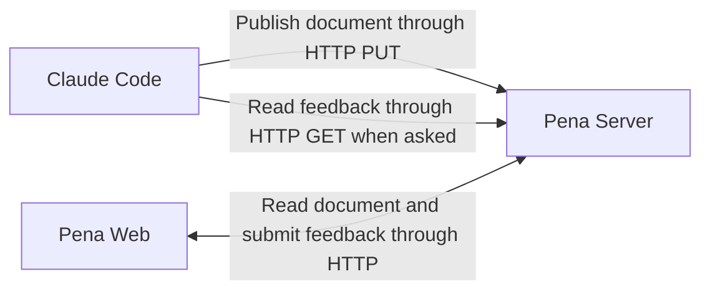

# PRD

Pena — [Initial Specification](./INITIAL_SPEC.md)

# Overview

[!info]
*This is the initial architecture. Its in-memory storage design has been
superseded by [Persistent Storage Architecture](./PERSISTENT_STORAGE_ARCHITECTURE.md).
The current implementation also stores an explicit title and Markdown content
in every immutable document version. Markdown headings are content, not
document metadata.*

Pena is a local web-based document review interface. Claude publishes a Markdown document to Pena under a document slug, the user reviews it in the browser, and Claude reads the submitted feedback for that slug when the user asks for it.

Automatic feedback delivery remains the intended experience. However, we do not need to solve it in the first slice. A manual prompt gives us a complete review loop while keeping the first implementation small.

# System Design



Pena consists of three parts in the first slice:

- **Pena Server** — stores the current document and submitted feedback for each slug, and exposes the HTTP API.
- **Pena Web** — renders the document and collects comments attached to selected text.
- **Claude Instruction** — a copy-pasted prompt that tells the active Claude Code session how to publish a document and read feedback.

## The Pena Server

The Pena Server is a local HTTP server bound to `127.0.0.1`. It is the shared boundary between Claude Code and the browser.

Its initial responsibilities are:

- Accept a Markdown document from Claude under a slug.
- Return the current document for that slug to the browser.
- Accept a batch of comments for that slug from the browser.
- Keep submitted feedback available until the same document is replaced.
- Return submitted feedback for the requested slug when Claude requests it.

Pena does not associate a Claude Code session identity with a document. The document slug is the only namespace. This lets several Claude Code sessions use one running Pena server without requiring session registration or lifecycle tracking.

## The Pena Web

The web interface reads the current title-and-content version from the Pena
Server using its workspace and slug. The user can select Markdown text, attach
a comment, repeat the same process for other passages, and submit the comments
together.

The browser uses normal HTTP for reading and submitting data. The first slice provides a refresh action to load replaced document content. Automatic refresh may be added later.

The interface uses dark mode from the beginning. This includes the document surface, comment panel, text selection, comment markers, and Markdown code blocks. The initial version can use plain CSS with shared color variables; a styling framework is not needed yet.

There is no document list, search, or navigation interface for now. Each document is opened through its direct local URL, for example `http://127.0.0.1:5173/documents/initial-spec`.

## The Claude Instruction

The user copy-pastes one instruction into the active Claude Code session. The instruction describes the workflow Claude should follow when working with Pena:

1. Choose a stable lowercase, kebab-case slug for the document.
2. Publish the requested document under that slug through the Pena HTTP API using `curl`.
3. Read submitted feedback for the same slug when the user explicitly asks for it.
4. Apply the feedback based on the user's request.
5. Publish the updated document under the same slug when another review cycle is needed.

For example, Claude can publish a complete document version with:

```bash
curl --request PUT \
  --header "Content-Type: application/json" \
  --header "If-None-Match: *" \
  --data '{"title":"Initial Specification","content":"## Overview\n\nDraft."}' \
  http://127.0.0.1:8788/api/workspaces/default/documents/initial-spec
```

The instruction contains the HTTP endpoints and exact commands, so a Pena Skill, plugin, and dedicated CLI are not needed for the first slice.

## The Feedback Delivery

The user submits one or more comments as a feedback batch. The server keeps every batch for the requested document in its local SQLite database.

When the user says something like *"read my Pena feedback"*, Claude requests the stored batches for its document slug and decides how to apply them. Reading feedback does not mark it as handled. Publishing a replacement document clears feedback for that slug only.

This is intentionally manual. Automatic notification, background monitoring, delivery acknowledgements, and reconnection behavior are deferred until the document review experience itself has been validated.

# The Future Integration Options

[!info]
*The following options are not part of the first slice.*

## Option #1: Claude Code Channel

A custom Claude Code Channel can push events from an MCP server directly into the active session.

Pros:

- Designed specifically for pushing external events into a running Claude Code session.
- Events are queued while Claude is busy.
- Does not require Pena to manage Claude Code itself.

Cons:

- Channels are still in research preview.
- A custom Channel requires a special development launch flag during the initial development.
- Availability may depend on the user's authentication method and organization policy.
- It introduces an MCP boundary when most of Pena already communicates through HTTP.

## Option #2: HTTP Stream Through Claude Code Monitor

Pena exposes a newline-delimited JSON stream. Claude Code runs `curl` through its Monitor tool and receives each feedback batch as one line.

Pros:

- Keeps the application boundary based on HTTP.
- Works with the normal interactive Claude Code terminal session.
- Does not require a custom Channel, MCP server, or Pena CLI.
- Uses tools already available in the Claude Code terminal environment.
- The connection only needs to live while the Claude Code session is open.

Cons:

- The Monitor must be started before feedback can reach Claude.
- Monitor notifications may become visible to Claude while it is still working.
- The workflow depends on Claude invoking the Pena Skill correctly.
- Reconnection behavior must be handled by the Monitor command or the server.
- Claude Code Monitor has its own version, provider, and environment restrictions.

## The Initial Direction For Automatic Delivery

When automatic delivery is implemented, the initial direction remains solution **#2: HTTP Stream Through Claude Code Monitor** because:

1. **It keeps the first architecture small** — Pena only needs an HTTP server, a browser interface, and a skill.
2. **It preserves the normal Claude Code experience** — the user can continue using the interactive terminal without starting Claude through a Pena wrapper.
3. **It avoids an experimental integration boundary** — Channels remain a possible fallback, but Pena does not need to depend on them initially.
4. **It matches the session lifecycle** — the Monitor connection runs while the Claude Code session is open and stops when the session ends.
5. **It is easy to validate** — a small spike can prove whether feedback arrives at the expected time before the complete interface is built.

While this solution depends on Claude starting and maintaining a Monitor, the reduced integration complexity makes it a better initial direction. A custom Channel remains the fallback if Monitor delivery does not provide the expected behavior.

# The HTTP API

The initial API may look like this:

| Method | Endpoint | Purpose |
|---|---|---|
| `PUT` | `/api/workspaces/:workspaceSlug/documents/:slug` | Publish a complete title-and-content version |
| `GET` | `/api/workspaces/:workspaceSlug/documents/:slug` | Read the current document version |
| `POST` | `/api/workspaces/:workspaceSlug/documents/:slug/feedback` | Submit a batch of comments for the current version |
| `GET` | `/api/workspaces/:workspaceSlug/documents/:slug/feedback` | Read feedback for the current version |

The exact payloads are intentionally not fixed yet. They should be decided while implementing the first vertical slice.

# The Data

## The Document

Pena keeps immutable document versions containing an explicit title and
Markdown content. A slug uses lowercase letters, numbers, and single hyphens,
with a maximum length of 64 characters. The slug is stable identity; changing
either the title or content creates the next version. Publishing an identical
title and identical content is an idempotent no-op. The document surface
renders the explicit title above the Markdown body, so the body starts with
prose or H2 sections rather than repeating the title as an H1.

## The Comment

Each comment contains:

- The selected text
- The user's comment
- Enough location or surrounding context to identify the passage

## The Feedback Batch

A feedback batch contains one or more comments submitted together. Pena returns all batches for the current document when Claude requests feedback.

The first implementation used an in-memory map. Pena now stores immutable
versions and feedback batches in SQLite so they survive server restarts.
Feedback remains attached to the version on which it was submitted. Publishing
a changed title or content starts a new current version without copying the
previous version's feedback.

# The Technical Stack

After careful consideration we recommend using the following stack:

| Area | Choice | Purpose |
|---|---|---|
| Language | TypeScript | Use the same language and contracts across the server and web application |
| Runtime | Node.js 24 | Run the local server on the current LTS release line |
| Package manager | pnpm | Manage dependencies and the workspace |
| Server | Fastify | Serve the HTTP API and built web application |
| Web | React and Vite | Build the interactive document review interface |
| Markdown | `react-markdown` and `remark-gfm` | Render Markdown and GitHub Flavored Markdown in the browser |
| Runtime validation | Zod | Validate API payloads and derive their TypeScript types from shared schemas |
| Styling | Plain CSS with color variables | Build the dark-mode interface without introducing a styling framework yet |
| Unit and integration tests | Vitest | Test the server, shared contracts, and browser logic |
| Browser tests | Playwright | Test text selection, comments, submission, and document refresh behavior |
| Storage | SQLite through `better-sqlite3` | Keep the current document and submitted feedback across server restarts |

Node.js 24 should be recorded in `.nvmrc`, so contributors using `nvm` can activate the expected runtime with `nvm use`.

## Runtime Validation

TypeScript checks our code while we develop it, but those types do not exist when the application is running. The Pena Server still needs to validate data received from the browser or a direct HTTP command.

Zod provides this runtime validation. For example, it can reject a feedback payload when `selectedText` is missing or `comment` is not a string. The same Zod schema can also produce the TypeScript type used by both the server and web application, so the runtime validation and compile-time contract do not drift apart.

Zod is not an architectural requirement — we could write the checks manually. However, the web application, server, and Claude-facing event stream all exchange structured data. A small shared validation layer is worth the dependency here.

## The Monorepo

Pena starts as a pnpm workspace with separate applications and shared contracts:

```text
apps/
  server/
  web/
packages/
  contracts/
docs/
resources/
  skills/
    pena/
      SKILL.md
tests/
  e2e/
```

The server and web application have different build and runtime boundaries, while `packages/contracts` contains the schemas and types used by both. The Pena skill stays under `resources` so users can copy it into their agent environment without confusing it with repository-development tooling.

We do not need Turborepo or another build orchestrator initially. pnpm workspaces and root-level scripts are enough for this repository size. We can introduce additional orchestration later if the build graph becomes difficult to manage.

## The Web Implementation

The browser can use the native `Selection` and `Range` APIs for the initial text-selection flow. A comment should keep the selected text and enough surrounding context to identify the passage. We should only introduce a dedicated annotation library if the native implementation proves insufficient during the first vertical slice.

Vite serves the web application during development and proxies `/api` requests to Fastify. The web interface provides a refresh action instead of maintaining an event stream. For a production-like local run, Fastify serves the built web application together with the API.

A Pena CLI may be introduced later if direct HTTP commands become difficult to maintain, automatic server startup is needed, or cross-platform behavior becomes important. It is not part of the initial architecture.

# The First Slice

The first slice is complete when:

1. The user starts Pena with `pnpm dev`.
2. Claude chooses a document slug and publishes a Markdown document through the HTTP API.
3. The user opens `/documents/:slug`, and the browser renders the document in dark mode.
4. The user selects at least two passages and comments on them.
5. The user submits both comments together.
6. The user asks Claude to read the Pena feedback.
7. Claude retrieves every submitted feedback batch for the same slug through the HTTP API.
8. Claude can publish an updated document under the same slug for another review cycle.
9. A second Claude Code session can use another slug without mixing documents or feedback.

# Open Questions

* **Q: How should Pena be distributed and started after the development workflow is validated?**
* **Q: When should the copy-paste instruction become a Pena Skill or plugin?**
* **Q: How should a selected passage be anchored when Markdown rendering changes its DOM structure?**
* **Q: Which automatic feedback delivery mechanism should be implemented after the first slice?**

# Related Documentation

- [Pena Initial Specification](./INITIAL_SPEC.md)
- [Pena Skill](../resources/skills/pena/SKILL.md)
- [Claude Code Monitor Tool](https://code.claude.com/docs/en/tools-reference#monitor-tool)
- [Claude Code Plugin Monitors](https://code.claude.com/docs/en/plugins-reference#monitors)
- [Claude Code Channels](https://code.claude.com/docs/en/channels)
