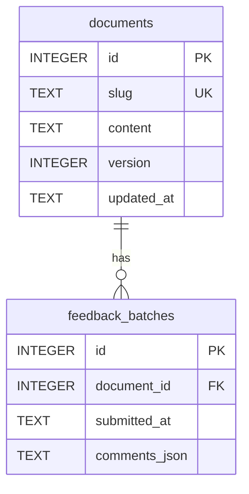

# PRD

Pena Persistent Storage

# Overview

[!info]
*Pena currently stores published documents and submitted feedback in memory. Everything disappears whenever the server restarts. This document defines the minimum persistent storage architecture needed to keep that data safely without turning Pena into a database-heavy application.*

The goal is straightforward: once Pena successfully publishes a document or accepts feedback, that data must survive browser refreshes, server restarts, and normal machine reboots.

Persistence covers:

- The current published document for every slug.
- The document's current version number.
- The document's `updatedAt` value.
- Every submitted feedback batch.
- Every submitted comment, including decision answers currently encoded as comments.

Persistence does not cover:

- Unsubmitted browser drafts.
- Document revision history.
- Feedback belonging to a document after that document is replaced.
- User accounts, authentication, cloud sync, or multiple devices.
- Automatic backup and restore.

In short, the persistence guarantee is:

> Once a document or feedback batch receives a successful API response, it remains available until it is replaced according to Pena's lifecycle rules or the configured database file is removed.

# Requirements

## Functional Requirements

1. Published documents must survive Pena server restarts.
2. Submitted feedback batches and comments must survive Pena server restarts.
3. Documents and feedback must remain isolated by document.
4. Publishing different content under an existing slug must replace the document and clear its previous feedback atomically.
5. Publishing identical content under an existing slug must preserve its feedback and `updatedAt`.
6. A new document must start at version `1`.
7. Publishing changed content must increase the document version by one.
8. Publishing identical content must preserve the current document version.
9. Reading feedback must not consume, modify, or mark it as handled.
10. Feedback batches must be returned in submission order.
11. Pena must validate persisted comment data before returning it through the API.

## Operational Requirements

1. Pena must remain a local, single-process application.
2. Persistence must not require a separate database service.
3. The database must initialize automatically on first startup.
4. Schema changes must be applied through versioned migrations.
5. Pena must fail startup when it cannot safely open or migrate its database.
6. Pena must never silently fall back to in-memory storage.

# System Design

## The Storage Engine

### Option #1: JSON File

Pros:

- No database dependency.
- Easy to inspect manually.
- Small initial implementation.

Cons:

- Every mutation requires safely rewriting the file.
- Atomic updates and concurrent requests need additional handling.
- Partial writes may corrupt the complete data store.
- Schema migrations become custom file-transformation code.

### Option #2: Node Built-In SQLite

Pros:

- No third-party package.
- SQLite ships with the Node runtime.
- Provides transactions and file-backed persistence.

Cons:

- `node:sqlite` is still relatively new.
- Its stability and available features are tied directly to the installed Node version.
- Pena would need to raise and enforce a more specific Node runtime requirement.

### Option #3: `better-sqlite3`

Pros:

- Mature and widely used in Node applications.
- Straightforward synchronous queries and transactions.
- No external database service.
- Works well for Pena's small, local workload.

Cons:

- Adds a native dependency.
- Node upgrades may occasionally require a compatible `better-sqlite3` release.
- Unsupported platforms may need to compile the native module locally.

### The Recommended Solution

After careful consideration we recommend implementing solution **#3: `better-sqlite3`** because:

1. **The persistence layer is foundational** — a mature database driver is worth one dependency.
2. **Transactions are simple** — document replacement and feedback deletion can be committed as one operation.
3. **The access model fits Pena** — synchronous, short operations are appropriate for a local single-process server.
4. **There is no additional service** — SQLite remains one file owned by Pena.

While `better-sqlite3` adds a native dependency, the stronger maturity and simpler transaction model are more valuable for data that must survive restarts.

## The Storage Boundary

HTTP routes must not contain SQL. They depend on a small storage contract:

```ts
interface PenaStore {
  publishDocument(slug: string, content: string): PenaDocument;
  getDocument(slug: string): PenaDocument | null;
  addFeedback(
    slug: string,
    submission: FeedbackSubmission,
  ): FeedbackBatch;
  getFeedback(slug: string): FeedbackResponse;
  close(): void;
}
```

`SqlitePenaStore` is the production implementation. Tests may use the same implementation with SQLite's `:memory:` mode, except for restart-persistence tests that require a temporary database file.

The server opens one connection during startup, passes the store into `buildApp`, reuses the connection for all requests, and closes it during graceful shutdown.

An ORM or query builder is not needed for two tables. Keeping the SQL inside `SqlitePenaStore` gives us enough separation without adding another abstraction layer.

## The Database Location

The default database location is:

```text
<pena-project-root>/.db/pena.sqlite
```

The path must resolve from the Pena project root — not the shell's current working directory. This avoids silently creating another database when Pena is started from a different directory.

The complete path can be overridden:

```bash
PENA_DB_PATH=/some/location/pena.sqlite pnpm dev
```

Pena creates the parent directory when needed and logs the resolved database path during startup. The `.db/` directory is excluded from Git, including SQLite's `-wal` and `-shm` companion files.

The data remains persistent as long as the selected database file remains intact.

## The Data Lifecycle

### Publishing a New Document

`PUT /api/documents/:slug` inserts a new document when its slug does not exist.
The document starts at version `1`.

### Republishing Identical Content

If the stored Markdown and submitted Markdown are exactly equal — including whitespace and line endings — Pena treats the request as a retry:

- Return the existing document.
- Preserve the current version.
- Preserve `updatedAt`.
- Preserve all submitted feedback.

This keeps document publishing idempotent and avoids deleting feedback because of a network or agent retry.

### Replacing Changed Content

If the Markdown differs, Pena performs the following inside one transaction:

1. Delete all feedback for the document.
2. Update the document content.
3. Increase the version by one.
4. Set a new `updatedAt`.

Either every step succeeds or none of them does.

The document's internal ID remains unchanged. One slug continues to represent one current document, and all feedback applies exclusively to that exact document content.

The version is only a revision counter. Pena does not retain old content or provide an API for retrieving previous versions.

### Submitting Feedback

Submitted feedback is append-only:

- A submission creates one feedback batch.
- Comments remain grouped and ordered inside that batch.
- Reading feedback does not mutate it.
- Feedback remains available until changed document content replaces the current document.

There is no document deletion, individual feedback deletion, revision history, or soft deletion in this implementation.

# Database Schema

## The Documents Table

`documents.id` is the internal relational identity. `documents.slug` remains the unique public lookup key used by the HTTP API.

Using an internal integer ID keeps database relationships independent from the public slug and allows slug changes later without rewriting related records.

## The Feedback Batches Table

`feedback_batches.id` is an integer primary key used internally and returned by the API. A separate public UUID is not needed because Pena does not create feedback offline, expose feedback IDs in public URLs, or merge records from different databases.

Comments are stored as one JSON array because Pena currently:

- Submits a complete batch.
- Reads a complete batch.
- Never edits or queries an individual comment.

If individual comment operations become necessary later, we can migrate the JSON into a normalized `comments` table. Adding that table now would not serve a current requirement.

```sql
CREATE TABLE documents (
  id         INTEGER PRIMARY KEY,
  slug       TEXT NOT NULL UNIQUE,
  content    TEXT NOT NULL,
  version    INTEGER NOT NULL DEFAULT 1 CHECK (version >= 1),
  updated_at TEXT NOT NULL
) STRICT;

CREATE TABLE feedback_batches (
  id            INTEGER PRIMARY KEY,
  document_id   INTEGER NOT NULL
                REFERENCES documents(id) ON DELETE CASCADE,
  submitted_at  TEXT NOT NULL,
  comments_json TEXT NOT NULL
) STRICT;

CREATE INDEX feedback_batches_document_id_id
  ON feedback_batches(document_id, id);
```



DB Changelog: 2026-07-19 - [PENA] Define the initial persistent storage schema.

DB Changelog: 2026-07-20 - [PENA] Add the current document version.

# Database Initialization

Pena manages lightweight, numbered migrations using SQLite's `PRAGMA user_version`. A migration framework is not needed yet.

On startup, Pena:

1. Opens or creates the configured database file.
2. Enables foreign-key enforcement.
3. Configures a short busy timeout.
4. Enables WAL journal mode.
5. Reads the current schema version.
6. Applies each missing migration inside a transaction.
7. Starts the HTTP server only after initialization succeeds.

The first migration creates the `documents` and `feedback_batches` tables and their index. The second migration adds `documents.version` and initializes existing documents at version `1`.

If the database schema is newer than the running Pena version understands, Pena refuses to open it. This is safer than guessing whether an older server can write to a newer schema.

# REST API

The existing endpoints remain unchanged:

| Method | Endpoint | Behavior |
|---|---|---|
| `PUT` | `/api/documents/:slug` | Publish, retry, or replace the current document |
| `GET` | `/api/documents/:slug` | Read the current document |
| `POST` | `/api/documents/:slug/feedback` | Submit one feedback batch |
| `GET` | `/api/documents/:slug/feedback` | Read all feedback batches |

Existing route status codes remain unchanged. Posting feedback for a missing document continues to return HTTP `409`.

## API Contracts

The document contract includes the current version:

```json
{
  "slug": "initial-spec",
  "content": "# Initial Spec",
  "version": 1,
  "updatedAt": "2026-07-19T10:00:00.000Z"
}
```

The feedback batch ID changes from a UUID string to a positive integer:

```json
{
  "id": 42,
  "submittedAt": "2026-07-19T10:01:00.000Z",
  "comments": [
    {
      "selectedText": "Selected document text",
      "comment": "Please clarify this section.",
      "contextBefore": "",
      "contextAfter": ""
    }
  ]
}
```

The shared feedback schema must validate the ID as a positive integer.

Feedback retrieval orders batches by integer ID ascending. This preserves submission order without introducing a separate sequence column.

Before returning persisted feedback, Pena parses `comments_json` and validates it through the shared comment schema. Invalid persisted data returns HTTP `500`; Pena never silently skips corrupt batches or comments.

Internal document IDs are not exposed through the API.

# Failure Handling

- A database open failure prevents server startup.
- A migration failure rolls back and prevents server startup.
- Pena never recreates or resets the database automatically after an error.
- Pena never falls back to in-memory storage.
- Request-level database failures return HTTP `500`.
- Document replacement remains atomic even when one of its database operations fails.
- Corrupt persisted comment JSON returns HTTP `500` without modifying the stored record.

# Verification

## Storage Tests

- Create and retrieve a document.
- Append and retrieve multiple feedback batches.
- Preserve comment order inside each batch.
- Return feedback batches in integer-ID order.
- Isolate documents and feedback.
- Reject feedback for a missing document.
- Replace changed content and clear only its feedback.
- Start new documents at version `1`.
- Increment the version when changed content replaces a document.
- Republish identical content without changing its version, timestamp, or feedback.
- Roll back replacement when part of the transaction fails.

## File Persistence Test

The restart-persistence test must use a temporary SQLite file:

1. Open a store.
2. Create a document and submit feedback.
3. Close the store.
4. Open another store using the same file.
5. Verify that the document, feedback, timestamps, and IDs remain unchanged.

An in-memory database cannot prove this requirement.

## Migration and Integrity Tests

- Initialize a new database with the first migration.
- Migrate existing documents to version `1`.
- Reopen an initialized database without rerunning migrations.
- Reject a database with a newer unsupported schema version.
- Return an error for invalid stored comment JSON.

## API Regression Tests

- Preserve all existing endpoint behavior.
- Return numeric feedback batch IDs.
- Return the current document version.
- Increment the version only after changed content is published.
- Preserve feedback after an identical publish.
- Delete feedback after a changed publish.
- Return feedback in submission order.
- Return HTTP `500` for storage failures.

## Manual Acceptance

1. Publish a document.
2. Submit comments.
3. Stop Pena.
4. Restart Pena.
5. Verify that the document and comments remain available.
6. Republish identical content and verify that the comments remain.
7. Publish changed content and verify that the comments are cleared.

No new browser end-to-end test is required because the browser continues to use the same HTTP API.

# Implementation Scope

The first persistence implementation includes:

- Add `better-sqlite3` and its TypeScript definitions.
- Add the `PenaStore` contract and `SqlitePenaStore`.
- Add schema versioning and the first migration.
- Change feedback batch IDs from UUID strings to integers.
- Inject storage into `buildApp`.
- Open the file-backed database during startup and close it during graceful shutdown.
- Ignore `.db/` in Git.
- Replace the in-memory server tests with SQLite-backed tests.
- Add a real-file restart-persistence test.
- Update the existing architecture documentation where it still describes in-memory storage.
- Run the build, type checking, and complete test suite.
- Perform the restart acceptance check.

# Out of Scope

- Persisting unsubmitted browser drafts.
- Document revision history.
- Soft deletion or recovery of replaced feedback.
- Backup and restore commands.
- Multiple server processes sharing one database.
- Cloud synchronization.
- Authentication or multiple users.
- Individual comment querying or editing.
- A normalized comments table.
- A database administration interface.

# JIRA

TBD

# Related Documentation

- [Initial Architecture](./INITIAL_ARCHITECTURE.md)
- [Initial Specification](./INITIAL_SPEC.md)
- [Feedback Model](./FEEDBACK_MODEL.md)
- [Interactive Decision Blocks Plan](./INTERACTIVE_DECISION_BLOCKS_PLAN.md)
